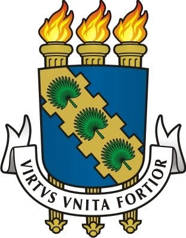

# Curriculum-Vitae

### Formação
-  **Universidade Federal do Ceará**
    - Bacharelado em Ciência da Computação (2014 - 2019)

-  **Instituto Federal de Educação, Ciência e Tecnologia**
    - Curso Técnico de Nível Médio Integrado em Informática (2009 - 2013)

